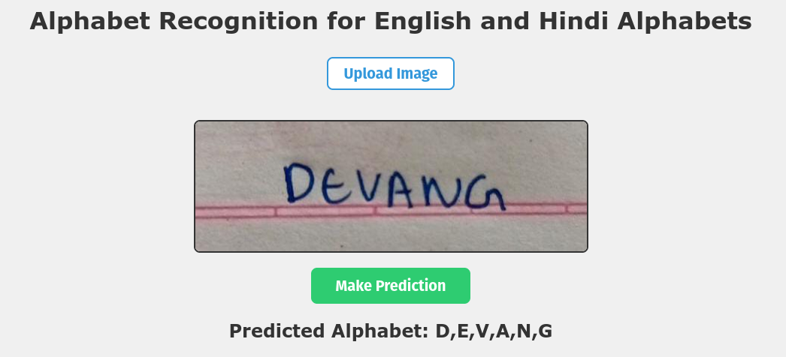

# English and Hindi Alphabet Recognition Project

This project focuses on building a computer vision model to recognize handwritten English and Hindi alphabets using deep learning. The project includes data processing scripts, analysis of the dataset, and the implementation of deep learning models for alphabet recognition for both English and Hindi languages.

**You can test out the live application yourself [on this website](https://alphabet-recognition-for-english-and.onrender.com/)**

## Project Setup

### Dataset
The dataset used in this project includes:
- **English Dataset**: Handwritten alphabet images obtained from [A-Z Handwritten Alphabets in .csv format Kaggle](https://www.kaggle.com/datasets/sachinpatel21/az-handwritten-alphabets-in-csv-format/data).
- **Hindi Dataset**: Handwritten Devanagari characters obtained from [Devanagari Handwritten Character Dataset](https://archive.ics.uci.edu/dataset/389/devanagari+handwritten+character+dataset).

### Data Processing
To prepare the data for model training, the following steps were performed:
1. **English Dataset**: A script (`csv_to_images.py`) was used to convert the CSV data containing pixel values for English alphabets into images. The script reshapes the data, encodes labels, and saves images to folders with subfolders for each alphabet class.
2. **Hindi Dataset**: The Devanagari characters dataset was structured with separate subfolders for each character in both training and testing sets.

### Combining Datasets
Both English and Hindi datasets were combined into a unified dataset with folders for training and testing images. The combined dataset is structured to facilitate model training on alphabets from both languages.

## Image Analysis and Model Building

### Image Distribution Analysis
An analysis of the distribution of images in each class was performed. This included plotting the count of images in each class and sorting them from highest to lowest.

### Deep Learning Model
**CNN(Convolutional Neural Network):** A convolutional neural network (CNN) model was implemented using TensorFlow for image recognition. The model was trained on the combined dataset to recognize alphabets from both English and Hindi languages.

**ResNet(Residual Network)**: Another model was trained using the ResNet Architecture. It is specifically used to overcome the vanishing gradient problem that occurs during backpropagation in CNN. 

### Model Augmentation
Data augmentation techniques were applied to the training dataset to increase variety and improve model performance.

### Model Evaluation and Alternative Models
The CNN model was evaluated, and it displayed impressive performance with around 94% accuracy on the training set and around 98% accuracy on the test set(validation accuray). 

*The ResNet model outperformed the CNN model* and gave an accuray of 98% on the training set and also on the test set.

### Model Deployment with FastAPI
A simple user interface for testing the model was created using FastAPI along with html and javascript code for the UI. The interface allows users to upload images and receive predictions for recognized alphabets.

## Usage
1. Download the datasets from the provided sources.
2. Run the `csv_to_images.py` script for the English dataset to convert CSV data to images.
3. Combine the English and Hindi train and test datasets into a unified dataset structure.
4. Perform analysis and model training using the `model_training.ipynb` notebook. If you don't want to train the model, you can download the trained model from `models` directory.
5. Once you have the model, you can run the `main_api.py` script that runs a FastAPI application for a user interface. To run the fast api application you need to run the following command in the terminal `uvicorn main_api:app --reload`

## Project Structure
- **`csv_to_images.py`**: Script to convert CSV data to images for the English alphabet dataset.
- **`english_hindi_combined_dataset/`**: Folder containing the combined English and Hindi alphabet datasets.
  - **`train/`**: Training images organized by class (alphabet).
  - **`test/`**: Testing images organized by class (alphabet).
- **`models/`**: Folder containing the trained alphabet recognition models.
 **`model_training.ipynb`**: Code for training testing and training various models for alphabet recognition and to find which model works best
- **`static/`**: Folder for static files in the FastAPI interface.
- **`main_api.py`**: Contains FastAPI code for creating an API for the trained model and to make predictions using the model

## Dependencies
All the packages and libraries required for this project can be installed using the `requirements.txt` file. Just run `pip install -r reqiurements.txt` in the command line/terminal to install all the necessary dependencies.

# Results

## Author
Created by: Devang Chavan.

Connect with me on [LinkedIn](https://www.linkedin.com/in/devang-chavan/).
